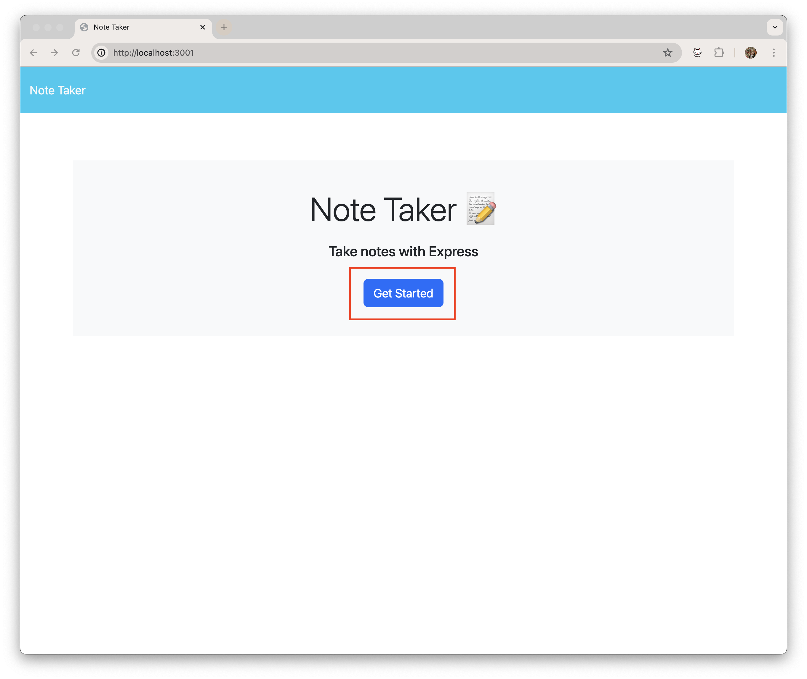
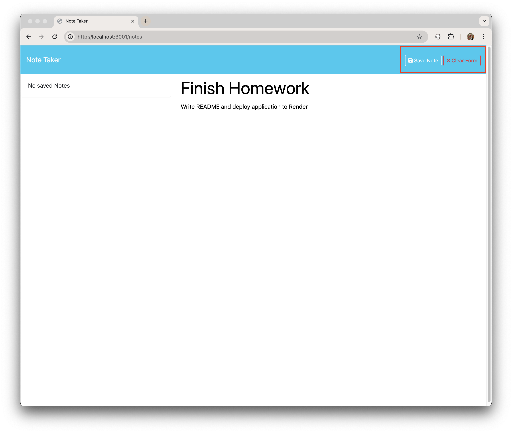
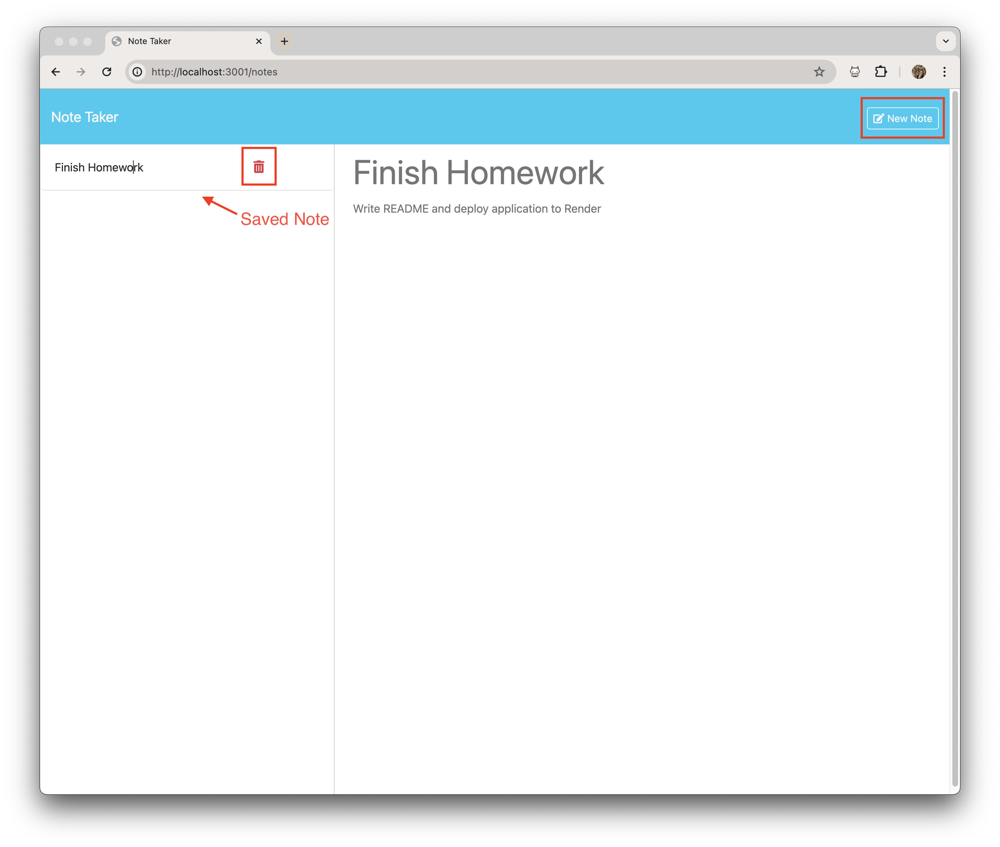
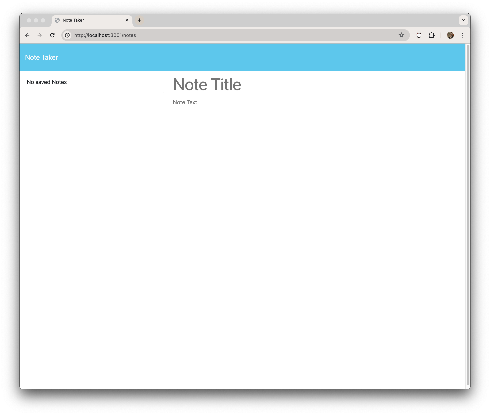

# Note Taker

## Description

This Note Taker application allows users to take, view, and delete notes. It uses Espress.js in the back end, saving and retrieving note data from a JSON file. This application was deployed using Render and can be viewed [here](https://note-taker-s49p.onrender.com).

## User Story

```md
AS A small business owner
I WANT to be able to write and save notes
SO THAT I can organize my thoughts and keep track of tasks I need to complete
```

## Acceptance Criteria

```md
GIVEN a note-taking application
WHEN I open the Note Taker
THEN I am presented with a landing page with a link to a notes page
WHEN I click on the link to the notes page
THEN I am presented with a page with existing notes listed in the left-hand column, plus empty fields to enter a new note title and the note’s text in the right-hand column
WHEN I enter a new note title and the note’s text
THEN a "Save Note" button and a "Clear Form" button appear in the navigation at the top of the page
WHEN I click on the Save button
THEN the new note I have entered is saved and appears in the left-hand column with the other existing notes and the buttons in the navigation disappear
WHEN I click on an existing note in the list in the left-hand column
THEN that note appears in the right-hand column and a "New Note" button appears in the navigation
WHEN I click on the "New Note" button in the navigation at the top of the page
THEN I am presented with empty fields to enter a new note title and the note’s text in the right-hand column and the button disappears
```

## Table of Contents

* [Description](#description)

* [User Story](#user-story)

* [Acceptance Criteria](#acceptance-criteria)

* [Installation](#installation)

* [Usage](#usage)

* [Tests](#tests)

* [Contributing](contributing)

* [Screenshot](#screenshot)

* [Deployed Application through Render](#deployed-application-through-render)

* [Questions](#questions)

## Installation

💾

`npm init`

`npm i express`

`npm i uniqid`

## Usage

💻

Open the application in your web browser and click the "Get Started" button. This will redirect you to the note-taking page.


On the right-side of the note-taking page, you are able to type in the title of your note as well as content for your note. Once filled out, the "Save Note" button and the "Clear Form" button will appear.

The "Clear Form" button will clear the right-side of the application and allow you to type a new note.

The "Save Note" button will save your current note to the left-side of the application.


Once a note is saved and appears in the left-side of the application, the user can click on it to view the note. While viewing, a "New Note" button will appear in the top-right corner of the page which will allow users to create a new note. A delete button will also appear next to notes in the left-side of the application which allows users to delete any unwanted notes they may not need anymore.


This is an image of the note-taking page when the saved notes are empty and nothing is written inside the note area.


## Tests

N/A

## Contributing

* [Vanessa Bou](https://github.com/rvbouu)

## Screenshot


## Deployed Application through Render

Click [here](https://note-taker-s49p.onrender.com) to view the deployed Render application.

## Questions

  [GitHub](https://github.com/rvbouu)

  For additional questions or concerns, please email me at rvbouu@gmail.com